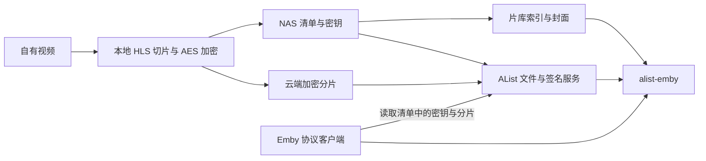

# alist-emby

让支持 Emby 协议的客户端播放 AList 上的加密 HLS 片库。

`alist-emby` 是使用 Python 标准库实现的轻量 Emby REST API 适配服务。它将 AList 的登录、文件签名和 HLS 播放链路转换为客户端可以识别的片库、播放信息和观看进度接口。无需安装 Emby Server，也无需修改 AList 源码。

本项目同时公开「本地切片加密 → 云端存储 → AList 签名播放 → Emby 客户端」方案。发布范围包含兼容服务、索引生成器、刮削与封面工具、自动化测试和部署模板；云盘上传编排和网页前台不包含在此仓库中。



## 已实现

- 服务器识别、用户名密码登录、退出及独立会话。
- 电影片库、详情、搜索、分页、最近入库和继续观看。
- 海报、背景图、演员、导演、片商和本地 NFO 信息。
- `PlaybackInfo` 与 HLS 播放入口；保留 AES-128、IV 和 BYTERANGE。
- 收藏、已看状态、观看进度、续播和显示偏好，保存在本地 SQLite。
- 可选的同机 AList 账号模式，使兼容会话不受上游登录 JWT 提前到期影响。
- 从本地媒体目录生成索引；不导出播放签名、清单正文或加密密钥。
- JavBus / JavTrailers 元数据查询、NFO 导入、封面下载与校验；缺封面时自动从加密 HLS 截帧补图。

已有部署中曾通过 Filebar iOS 验证登录、片库、播放、拖动和续播。其他客户端与其他 AList 版本需要实际验证；这不是完整的 Emby Server。

## 快速运行

需要 Python **3.11 或更高版本**、已运行的 AList，以及它能访问的 HLS 媒体目录。运行服务不需要 pip 依赖；视频准备阶段另需 FFmpeg。

媒体目录示例：

```text
/srv/media-hls/example/
  index.m3u8       # 播放清单，内部密钥与分片 URI 必须能由客户端读取
  key             # AES 密钥，放在私有存储并通过 AList 签名访问
  movie.nfo       # 可选
  poster.jpg      # 可选
  fanart.jpg      # 可选
```

在 AList 中将 `/srv/media-hls` 挂载为 `/m3u8`。这是当前索引与兼容服务约定的媒体路径前缀。

```sh
git clone https://github.com/zxcvbnmzsedr/alist-emby.git
cd alist-emby

python3 scripts/build_catalog.py --root /srv/media-hls --output ./catalog

CATALOG_PATH=./catalog/catalog.json \
STATE_PATH=./state \
ALIST_ORIGIN=http://127.0.0.1:5244 \
PUBLIC_ORIGIN=https://media.example.com \
python3 server.py
```

将 [Nginx 路由模板](deploy/nginx-location.conf.example) 加入现有 AList 的 HTTPS server 块，调整兼容服务上游地址并验证配置。`PUBLIC_ORIGIN` 是客户端可访问的公共地址，**不加 `/emby`**；该地址必须同时能访问兼容接口和 AList 的 `/d/`、`/p/` 文件路由。

客户端选择 Emby，填写 `https://media.example.com`，使用现有 AList 管理员账号登录。可支持显式 `/emby` 基础路径的客户端；部分客户端要求只填主机和端口。

仅检查服务启动时，可以用合成索引（它没有可播放的媒体）：

```sh
CATALOG_PATH=examples/catalog.json STATE_PATH=./state python3 server.py
curl http://127.0.0.1:8097/emby/System/Info/Public
```

## 配置

| 环境变量 | 默认值 | 作用 |
|---|---|---|
| `BIND_HOST` | `127.0.0.1` | 监听地址，通常由 Nginx 代理 |
| `PORT` | `8097` | 监听端口 |
| `PUBLIC_ORIGIN` | `http://127.0.0.1:8097` | 公共 AList 与兼容接口共同 origin；默认仅供本地启动检查 |
| `ALIST_ORIGIN` | `http://127.0.0.1:5244` | 服务端访问 AList 的地址 |
| `CATALOG_PATH` | `catalog/catalog.json` | 索引文件；封面相对其所在目录读取 |
| `STATE_PATH` | `state` | SQLite、图片签名私钥和可选媒体探测缓存目录 |
| `ALIST_DATABASE` | 未设置 | 同机模式的 AList SQLite 文件，只读访问 |
| `ALIST_CONFIG` | 未设置 | 同机模式的 AList 配置文件，读取 JWT 密钥 |

最后两个变量必须一起设置。普通 API 模式下，AList 登录 Token 到期后需要重新登录；同机模式依赖特定 AList 数据表与 JWT 字段，升级 AList 后应验证兼容性。

## 刮削与封面

刮削工具是按需执行的 CLI，不要求运行额外网页或 HTTP 服务。安装可选依赖：

```sh
python3 -m venv .venv
.venv/bin/python -m pip install -r requirements-scraper.txt

# 默认只查询和预览，--apply 才写 NFO、封面并更新索引。
.venv/bin/python scripts/import_metadata.py TEST_001 \
  --media-root /srv/media-hls --output ./catalog
.venv/bin/python scripts/import_metadata.py TEST_001 --apply \
  --media-root /srv/media-hls --output ./catalog

# 缺封面列表；自动模式先刮削，失败时取第 3 秒（需要 FFmpeg 和 AList 凭据）。
.venv/bin/python scripts/import_metadata.py --list-missing-covers --media-root /srv/media-hls
.venv/bin/python scripts/import_metadata.py --auto-cover \
  --media-root /srv/media-hls --output ./catalog
```

默认查询 JavBus 与 JavTrailers，成功来源之间核对编号、日期、片长和演员；已有标题、简介和封面保留。原 provider 源码一起存放在 `vendor/jav-metadata-syncer/`，来源见 [说明](vendor/jav-metadata-syncer/README.md)。来源站不可访问时明确失败，不伪造资料；也支持 `--metadata-json` 导入本地资料。完整命令、凭据配置与截帧流程见 [刮削器文档](docs/scraper.md)。

## 实现范围

当前只接受 AList 管理员：索引代表完整片库，尚未实现普通账号的目录权限过滤。支持电影，不支持完整剧集、字幕轨、在线转码、自动后台刮削、远程遥控、管理控制台或 Emby 授权功能。开启 OTP 等额外登录挑战的账号当前无法新登录。

服务把清单中的 URI 转成公共绝对地址，**不会自动为每个密钥和分片补签名或更新已有签名**。在准备或发布清单时应生成正确地址；如果签名会到期，需要相应刷新机制。详见 [媒体管线](docs/media-pipeline.md)。

退出会撤销兼容会话；已发出的 AList 媒体签名和图片签名各自按其规则继续有效。应用不记录请求 Token 或密码，反向代理也应关闭包含 query Token 的访问日志。详见 [认证边界](docs/authentication.md)。

## 文档与测试

- [整体方案与 Emby 协议映射](docs/architecture.md)
- [切片、加密、云端存储与发布流程](docs/media-pipeline.md)
- [部署、升级和回滚](docs/deployment.md)
- [认证、会话与签名边界](docs/authentication.md)
- [刮削、NFO 导入与截帧补封面](docs/scraper.md)

```sh
.venv/bin/python -m unittest discover -s tests -v
```

完整测试需上述刮削依赖，FFmpeg 用于合成加密 HLS 的解码测试。测试使用临时目录、合成数据和模拟 AList/资料源响应，不需要真实账号或媒体。覆盖真实本地 HTTP 请求、登录与撤销、图片签名隔离、播放清单转换、进度持久化、续播排序、NFO 与封面回滚、跨字节范围截帧和索引隐私边界。它们不代替真实 AList 与客户端播放验收。

## 许可证

MIT，见 [LICENSE](LICENSE)。本项目是独立的协议适配实现，与 AList、Emby 或客户端开发者没有官方关联。仅对本仓库的代码和文档授予许可，媒体及外部项目遵循各自授权。
