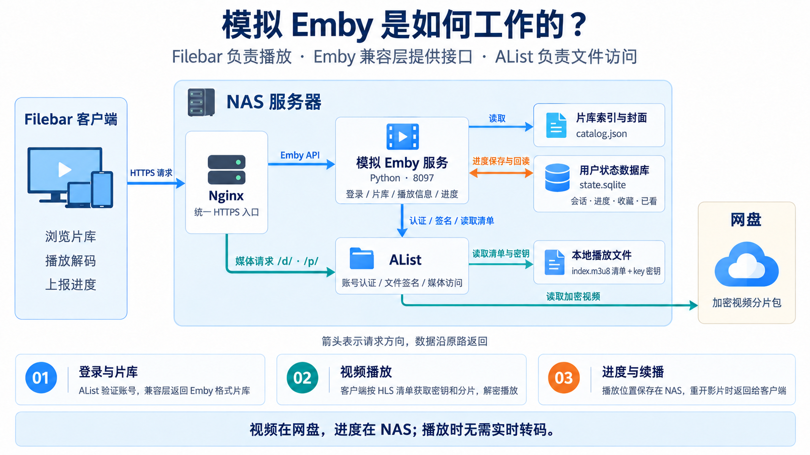

# alist-emby

基于 AList 的完整私人媒体方案：视频离线转码与加密打包、云端上传和校验、元数据刮削、Web 片库网页，以及供 Emby 客户端连接的协议兼容服务。

本仓库包含这套方案的应用源码、入库工具、部署模板和验证脚本。Web 片库前端位于 `cinema/src/`；Emby 兼容实现位于 `emby_bridge/server.py`。两者使用同一份影片索引。AList 和云盘由部署者自行配置。

## 工作原理



图中以 Filebar 为客户端示例。Emby 兼容服务提供片库、播放信息和观看进度接口；AList 提供账号认证、文件签名与媒体访问。NAS 保存索引、清单、密钥和用户状态，网盘保存加密视频分片包。客户端按 HLS 清单读取密钥和分片，完成解密与解码；播放阶段无需服务端实时转码。

## 功能与源码

| 功能 | 入口 |
|---|---|
| Web 片库网页：账号登录、片库、搜索、收藏、播放、拖动、续播、移动端 | [`cinema/`](cinema/) |
| Emby API：AList 管理员登录、会话、片库、封面、HLS、观看进度和收藏 | [`emby_bridge/`](emby_bridge/) |
| NFO 索引、片长与封面导出 | [`cinema/scripts/build_catalog.py`](cinema/scripts/build_catalog.py) |
| 刮削器、NFO 导入、在线封面、自动截帧和手动选帧 | [`cinema/scripts/import_metadata.py`](cinema/scripts/import_metadata.py) |
| 随仓提供的 JavBus / JavTrailers / MissAV provider 源码 | [`cinema/vendor/jav-metadata-syncer/`](cinema/vendor/jav-metadata-syncer/) |
| 代理上传 skill 与上传指导 | [`.agents/skills/alist-media-upload/`](.agents/skills/alist-media-upload/)、[上传说明](docs/upload-guide.md) |
| 视频扫描与任务清单 | [`scripts/inventory.py`](scripts/inventory.py) |
| 本机 HLS / AES / BYTERANGE 打包、SSH 传输、断点恢复与任务调度 | [`scripts/batch_media.py`](scripts/batch_media.py) |
| 服务端 AList 顺序上传、Range 与解码校验、签名清单发布 | [`scripts/batch_cloud.py`](scripts/batch_cloud.py) |
| 任务状态和经核验的原片清理 | [`scripts/batch_status.py`](scripts/batch_status.py)、[`scripts/cleanup_completed.py`](scripts/cleanup_completed.py) |
| 远程索引同步、本机刮削到 NAS、远程封面预览和发布 | [`cinema/scripts/`](cinema/scripts/) |
| HTTPS、网页鉴权、systemd 和运行环境模板 | [`deploy/`](deploy/)、[`cinema/nginx-pan.conf`](cinema/nginx-pan.conf) |
| Python / 前端测试、浏览器检查和真实部署验收 | [`tests/`](tests/)、[`cinema/tests/`](cinema/tests/)、[`emby_bridge/tests/`](emby_bridge/tests/) |

```text
本机视频 → FFmpeg HLS → 分段 AES-128 → 合并 pack → SSH 到 NAS
                                              ↓
                                   AList 上传到云盘并核验
                                              ↓
                    NAS 清单 + key + NFO + 封面 → catalog
                                              ↓
                            Web 片库网页 / Emby 客户端播放
```

根目录 `server.py` 启动 Emby 兼容服务；`scripts/` 中的同名刮削入口调用 `cinema/scripts/` 中的实现。

## 安装与本地验证

支持 Python 3.11+、macOS / Linux；前端需要 Node.js 22.12+。入库和截帧需要 FFmpeg、ffprobe、OpenSSL，远程流程需要 SSH / SCP。Windows 可通过 Linux 环境运行服务和流水线。

```sh
git clone https://github.com/zxcvbnmzsedr/alist-emby.git
cd alist-emby
python3 -m venv .venv
.venv/bin/python -m pip install -r requirements-scraper.txt

.venv/bin/python -m unittest discover -s tests -v
.venv/bin/python -m unittest discover -s cinema/tests -v
.venv/bin/python -m unittest discover -s emby_bridge/tests -v

cd cinema
npm ci
node --test tests/*.test.mjs
CINEMA_PUBLIC_DIR=../examples/cinema npm run build
npx playwright install chromium
npm run test:browser
```

`test:browser` 启动本机静态预览，以合成身份和片库验证登录拦截、深链接、失效会话、搜索、收藏和移动端布局。它不连接你的 NAS、不上传视频。`examples/` 均为合成示例，不包含可播放的私人媒体。

启动兼容服务并检查公共识别接口：

```sh
CATALOG_PATH=examples/catalog.json STATE_PATH=./state python3 server.py
# 另一个终端：
curl http://127.0.0.1:8097/emby/System/Info/Public
```

实际播放需要配置 AList、媒体目录和签名清单。开发网页可运行 `ALIST_ORIGIN=http://127.0.0.1:5244 npm run dev`，索引放在 `cinema/public/`，然后访问 `/cinema/`。开发服务器仅监听本机；正式网页应配套部署 OpenResty 鉴权配置。

## 部署与使用

- [完整部署与账号配置](docs/deployment.md)
- [上传指导与代理 skill](docs/upload-guide.md)
- [视频扫描、加密打包、云端入库和清理](docs/media-pipeline.md)
- [刮削、NFO、封面与选帧](docs/scraper.md)
- [Web 片库前端说明](cinema/README.md)
- [Emby 兼容范围](emby_bridge/README.md)
- [架构与协议约定](docs/architecture.md)
- [源码范围与私有数据排除清单](docs/source-scope.md)

Emby 客户端中选择 Emby 服务，使用你的 `PUBLIC_ORIGIN` 地址及 AList **管理员账号**登录。当前兼容服务没有完整 Emby 后台、在线转码或普通用户片库权限映射；不能代替完整 Emby Server。网页复用有效 AList 非访客账号；网页收藏和进度保存在当前浏览器，Emby 客户端记录由桥接 SQLite 保存，两种记录目前独立。

清单内的 key 和分片链接需要由 AList 正确签名并可由客户端访问。桥接服务只刷新入口清单签名，不重新签发内部链接；签名过期时重新发布。Cloud 上传使用 AList 已配置的挂载，不包含任何云盘账号或自动登录工具。

实际视频、密钥、Token、签名链接、私人片库和封面、运行状态、日志和个人部署配置均不提交。自身代码许可证见 [LICENSE](LICENSE)；随仓的 provider 来源说明见对应目录。
