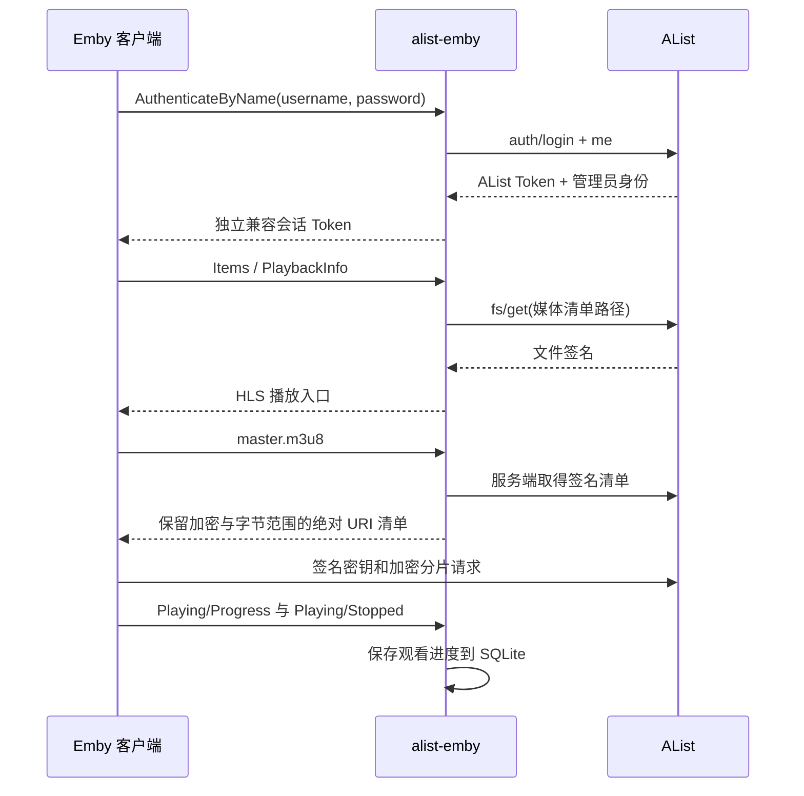

# 方案与协议映射

## 三层职责

1. **媒体层**：准备可直接播放的 HLS，保存 AES 密钥、清单和可选本地 NFO；大体积加密分片可放在 AList 挂载的云盘。
2. **AList 层**：负责账号登录、存储挂载、文件权限、签名下载和代理读取。兼容服务通过 `/api/auth/login`、`/api/me`、`/api/fs/get` 调用它。
3. **协议层**：`server.py` 将片库转换为 Emby 风格 DTO，处理独立会话、图片访问和观看状态，并提供 HLS 入口。

`catalog.json` 可以重建，媒体目录是资料真值；兼容服务的 SQLite 保存会话、收藏、进度、显示偏好和图片签名私钥。代码不导入 Emby 服务端、AList 服务端或第三方刮削代码。

## 登录与播放

桥接服务只读取清单，媒体与密钥请求走 AList。AList 的 `/p/` 路由仍可能代理媒体流量；方案不承诺云盘直连或零服务器流量。

## 主要接口

所有路径都支持 `/emby` 前缀。路由以代码实现为准；未实现接口返回 404，部分无内容接口返回空集合。

| 接口 | 行为 |
|---|---|
| `GET /System/Info/Public` | 公共服务器识别，返回协议兼容版本 |
| `POST /Users/AuthenticateByName` | AList 账号登录，返回独立会话 Token |
| `GET /Users/Me`、`/Users/{uid}` | 当前用户与能力声明 |
| `GET /Users/{uid}/Views` | 单一电影资料库 |
| `GET /Items`、`/Users/{uid}/Items` | 片库、搜索、过滤、排序与分页 |
| `GET /Items/{id}` | 详情与播放源 |
| `GET /Items/Latest`、`/Items/Resume` | 最近入库、继续观看；支持用户路径形式 |
| `GET /Items/{id}/Images/Primary`、`Backdrop` | 会话鉴权或受限图片签名访问 |
| `GET/POST /Items/{id}/PlaybackInfo` | 直接 HLS 播放源，不提供转码 |
| `GET /Videos/{id}/master.m3u8` | 读取 AList 清单并展开相对 URI |
| `POST /Sessions/Playing`、`Progress`、`Stopped` | 更新观看位置与最后播放时间 |
| `POST/DELETE /Users/{uid}/FavoriteItems/{id}` | 收藏与取消收藏 |
| `POST/DELETE /Users/{uid}/PlayedItems/{id}` | 已看与未看 |
| `GET /Users/{uid}/Items/{id}/UserData` | 观看状态与派生百分比 |
| `POST /Sessions/Logout` | 撤销当前兼容会话 |

影片 ID 来自 `sha256("movie:" + catalog.id)`，用户 ID 来自 AList 用户 ID。保持 catalog.id 稳定，才能持续关联观看记录；索引生成器以目录名作为此 ID。

进度以每秒 10,000,000 ticks 表示。`PlayedPercentage` 根据当前位置与当前片长计算，不单独持久化；停止位置达到片长的 95% 时标为已看并清空续播位置。继续观看按最近播放时间倒序排列后分页。

播放源可从状态目录的可选 `media.json` 读取 `MediaStreams`，格式是以 catalog.id 为键、以包含 `MediaStreams` 的对象为值。不提供自动探测任务；无缓存时返回空流描述。

## 索引格式

见 [合成示例](../examples/catalog.json)。必需字段为 `id`、`title`、`path` 和 `duration`（秒）。当前可播放路径须符合 `/m3u8/<目录>/index.m3u8`。`cover`、`backdrop` 必须为相对的 `covers/<文件名>.<图片扩展名>`。

`scripts/build_catalog.py` 累加真实清单的 `EXTINF` 获取片长，从本地 NFO 读取白名单字段，复制本地图像并以内容哈希命名。它跳过符号链接、不下载 NFO 中的远程图片、不导出密钥或清单正文；损坏 NFO 会使构建失败并保留旧索引。输出目录必须在私有媒体目录之外，但其中索引和封面仍包含片库信息，不应作为匿名静态资源公开。
