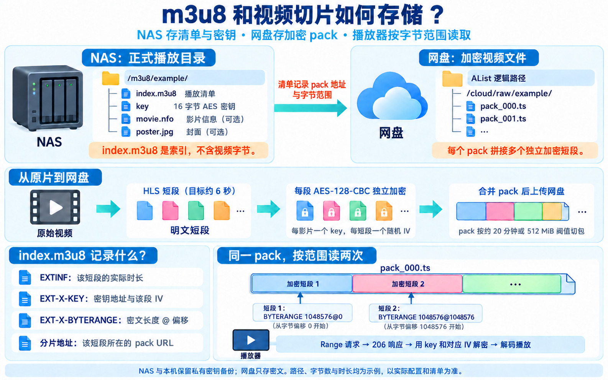

# 媒体存储结构

NAS 保存播放清单和密钥，网盘保存加密视频文件。播放器通过 AList 获取清单、密钥和所需视频字节。下面使用默认路径和合成示例；实际目录由环境配置决定。



## 发布后的目录

NAS 的正式播放目录由 `MEDIA_ROOT` 指定，默认是 `/m3u8`：

```text
/m3u8/
└── example/
    ├── index.m3u8       # 正式播放清单，包含签名资源地址
    ├── key              # 本影片的 16 字节 AES 密钥
    ├── movie.nfo        # 影片资料，可选
    └── poster.jpg       # 封面，可选
```

每部影片有独立目录。`index.m3u8` 是文本索引，不含视频字节。`key` 是二进制密钥文件，不是密钥的十六进制文本。AList 将这个媒体根目录挂载为 `/m3u8`，通过带签名的 `/d/m3u8/...` 地址提供访问。

网盘存储的是 pack 文件。下面展示 AList 的逻辑目录，不是 NAS 文件系统目录：

```text
/cloud/raw/             # ALIST_SEGMENT_ROOT 的默认值
└── example/
    ├── pack_000.ts
    ├── pack_001.ts
    └── ...
```

一个 pack 文件拼接多个独立加密短段。网盘无需保存每个约 6 秒短段的独立文件，也不保存该影片的 `key` 或正式清单。更换网盘挂载路径时，需要按实际配置重新发布清单中的签名地址。

网页目录默认是 `/srv/alist-emby/www/cinema`，由 `CATALOG_OUTPUT` 指定。其中的 `catalog.json` 和 `covers/` 提供片库索引与封面；它们与播放清单不同，正式部署时由网页鉴权保护。

## 短段如何变成 pack

1. FFmpeg 将原片封装为 HLS 短段，目标段长约 6 秒。实际段长取决于关键帧，清单使用真实时长。
2. 工具为每部影片生成一个随机 16 字节 key，为每个短段生成独立随机 IV。
3. 工具逐段执行 AES-128-CBC 加密，并对每段独立添加 PKCS#7 padding。
4. 工具将各段密文按播放顺序拼接为 `pack_000.ts`、`pack_001.ts` 等文件，按约 1200 秒或 512 MiB 阈值切包。
5. 工具记录每段的 pack 文件名、实际时长、IV、密文长度和偏移，再上传 pack 并发布正式清单。

pack 不是整包一次加密的连续视频流。每个短段都可以用自己的 IV 和影片 key 独立解密。打包过程中的明文短段是临时文件，成功后清理；原片默认保留。

## m3u8 怎样指向 pack

下面用同一 pack 中的两个短段说明格式。字节数、时长、IV 和签名均为合成示例；生产数据由工具生成。

```m3u8
#EXTM3U
#EXT-X-VERSION:4
#EXT-X-TARGETDURATION:6
#EXT-X-MEDIA-SEQUENCE:0
#EXT-X-PLAYLIST-TYPE:VOD
#EXT-X-KEY:METHOD=AES-128,URI="/d/m3u8/example/key?sign=KEY_SIGNATURE",IV=0x00000000000000000000000000000001
#EXTINF:6.000000,
#EXT-X-BYTERANGE:1048576@0
/p/cloud/raw/example/pack_000.ts?sign=PACK_SIGNATURE
#EXT-X-KEY:METHOD=AES-128,URI="/d/m3u8/example/key?sign=KEY_SIGNATURE",IV=0x00000000000000000000000000000002
#EXTINF:6.000000,
#EXT-X-BYTERANGE:1048576@1048576
/p/cloud/raw/example/pack_000.ts?sign=PACK_SIGNATURE
#EXT-X-ENDLIST
```

| 清单字段 | 含义 |
|---|---|
| `EXTINF` | 当前短段的实际播放时长 |
| `EXT-X-KEY` | 当前短段使用的密钥地址和 IV |
| `EXT-X-BYTERANGE` | 当前短段的密文长度与起始偏移，格式为 `长度@偏移` |
| pack 地址 | 当前短段所在的网盘文件；多个短段可以引用同一文件 |

上例中，播放器读取短段 1 时，请求 `Range: bytes=0-1048575`；读取短段 2 时，请求 `Range: bytes=1048576-2097151`。两次请求的文件地址相同，读取的范围不同。AList 与网盘必须返回对应的 `206 Partial Content` 和准确的 `Content-Range`。

播放器拿到该范围的密文后，用影片 key 和当前短段的 IV 解密，再解码播放。长度和偏移必须按密文字节计算，不能使用明文长度，因为 padding 会改变大小。换到下一个 pack 时，偏移重新从 0 开始。

## 打包、上传和恢复资料

本机默认工作目录是 `work/import/`，可用 `ALIST_EMBY_WORK_DIR` 覆盖：

```text
work/import/
├── inventory.json
├── state.json
└── jobs/JOB_ID/
    ├── job.json
    ├── private/
    │   ├── key
    │   ├── index.m3u8    # 发布前清单，使用相对的 key 和 pack 文件名
    │   ├── parts.json    # 每段的长度、偏移、时长、IV 与 pack 对应关系
    │   └── report.json   # pack 大小、SHA-256 与本机核验结果
    └── packs/
        ├── pack_000.ts
        └── ...
```

NAS 在 `BATCH_STATE_PATH/JOB_ID/` 保留任务、key、发布前清单和核验记录，在 `BATCH_PACKS_PATH/JOB_ID/` 暂存待上传 pack。默认路径分别是 `/var/lib/alist-emby/batches` 和 `/srv/alist-emby/packs`。

上传并核验成功后，可以清理本机和 NAS 暂存的 pack；保留密钥备份、清单与任务记录，网盘中的正式 pack 继续用于播放。恢复任务时复用原记录和 key，不重新加密已上传的密文。运行、恢复和清理命令见 [媒体入库流程](media-pipeline.md)。
